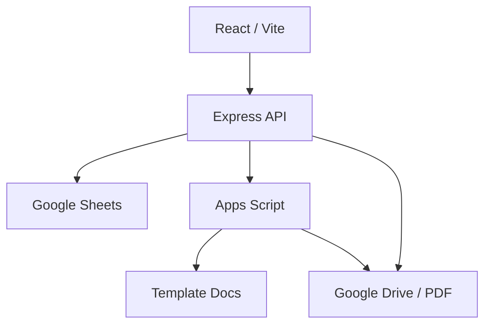

# AZMYA Invoice System — Handoff lengkap untuk Antigravity

Versi dokumen: 1.0 • Disusun: 10 September 2026 • Bahasa: Indonesia

Dokumen ini berdiri sendiri. Lampirkan bersama ZIP frontend/backend, atau simpan sebagai `AZMYA_HANDOFF_ANTIGRAVITY.md` pada root repository. Agent berikutnya tidak perlu memiliki riwayat percakapan sebelumnya untuk memulai. Bagian audit di bawah telah digabungkan, sehingga tidak perlu mencari lampiran audit terpisah.

## A. Instruksi awal untuk agent Antigravity

Tujuan pemilik: melanjutkan pengembangan AZMYA yang sudah deployed, memahami sistem, memperbaiki risiko/bug, meningkatkan maintainability dan memperbarui dokumentasi. Pertahankan sistem yang ada sambil melakukan perubahan kecil yang bisa diperiksa. Pemilik akan melampirkan ZIP kode frontend/backend.

**Mulai dengan membaca dokumen ini dan memeriksa kode yang benar-benar dilampirkan.** Baseline audit bukan jaminan ZIP terbaru identik. Bedakan fakta kode, hasil uji runtime, dugaan dan rekomendasi. Jangan mengklaim seluruh fitur telah diuji atau masalah telah diperbaiki hanya karena patch dibuat.

### Batas tindakan dan prioritas keselamatan data

- Pekerjaan awal yang dapat dilakukan: ekstraksi ZIP ke folder baru, pembacaan kode, inventaris dependensi, pemeriksaan Git, persiapan rencana dan setup lokal terisolasi.
- Jangan menghapus/menimpa data produksi, mengosongkan Trash, mengubah izin Drive, merotasi secret produksi, mengubah skema Sheets produksi, atau menjalankan endpoint mutasi produksi tanpa persetujuan spesifik pemilik.
- Jangan push ke branch produksi, merge, atau deploy produksi tanpa persetujuan. Pastikan patch, tes dan rencana deployment sudah konkret saat meminta persetujuan.
- Jangan menguji merge PDF lama sebelum jalur `emptyTrash` dihilangkan dan pengujian memakai salinan data. Audit menemukan efek samping penghapusan permanen pada jalur tersebut.
- Jangan menampilkan secret, isi DATA_USER atau data pribadi pelanggan di chat/log/commit. Dokumen ini sengaja tidak menyertakan password admin atau private key.
- Localhost dan Preview bukan jaminan isolasi: keduanya tetap dapat mengubah produksi jika ID/credential/folder-nya sama.
- Jangan membuat ulang aplikasi dari nol atau mengganti stack/database sekaligus. Migrasi database di dokumen adalah rekomendasi, belum keputusan implementasi.
- Jika sumber Google tidak dapat diakses, lanjutkan pekerjaan kode yang tidak bergantung padanya dan sebutkan bagian yang terblokir. Jangan mengarang isi Apps Script atau template.

### Pesan siap salin untuk memulai sesi

```text
Baca AZMYA_HANDOFF_ANTIGRAVITY.md dan seluruh kode ZIP yang saya lampirkan.
Ini aplikasi existing yang sudah berjalan di Vercel.

Mulai dari inventory kode dan perbedaan terhadap baseline audit, kemudian
siapkan branch pengembangan serta rencana local/staging yang tidak memakai
data produksi. Periksa semua ID Google yang masih hardcoded.

Laporkan struktur, risiko Critical/High, data konfigurasi yang belum ada,
dan tugas pertama dengan acceptance criteria. Lanjutkan pekerjaan lokal
non-destruktif yang memungkinkan. Jangan menjalankan mutasi Google produksi,
penghapusan/emptyTrash, perubahan sharing, push main, merge atau deployment
produksi tanpa persetujuan saya. Jangan memasukkan secret ke Git/chat.

Gunakan perubahan kecil dan bukti tes yang relevan. Pada akhir sesi tulis
apa yang diubah, apa yang diuji, apa yang belum selesai, dan langkah berikutnya.
```

## B. Identitas proyek dan sumber daya

| Item | Lokasi / nilai | Status bukti |
|---|---|---|
| Website produksi yang diaudit | https://azmya-invoice-web-b3nd.vercel.app/ | Target eksplorasi sebelumnya; jangan anggap selalu sama setelah handoff |
| Repository | https://github.com/CHAIZULHafiz/azmya-invoice-web | Publik saat pengambilan baseline |
| ZIP yang pernah diperiksa | `azmya-invoice-web-main.zip` | Komentar arsip menunjukkan commit baseline; tanpa direktori `.git` |
| Baseline kode | `cbbc3bc72ce532ca89ff4e4ddbdb31f6494ae985` | Dibaca melalui Git dan struktur ZIP |
| Commit produksi pada screenshot | `b386195` | Screenshot pengguna; bukan pembacaan dashboard terkini |
| Project Vercel | https://vercel.com/chaizulhafizs-projects/azmya-invoice-web-b3nd | URL pada screenshot; pengaturan privat belum dibaca |
| Apps Script editor | https://script.google.com/d/16jFjYuPdOaEOGupJYt6IYv5cHV-ft2j_Ds62fLJEE61cA3SP8zDbRRN7/edit?usp=sharing | Diberikan pengguna; isi tidak berhasil diakses |
| Spreadsheet | https://docs.google.com/spreadsheets/d/1O-ExcNwYJh9Nd5qheJs7vgFMQNz1O1kVfdzinefPWlg/edit?usp=sharing | ID cocok dengan konfigurasi contoh kode; isi tidak dibaca langsung |
| Folder Drive pengguna | https://drive.google.com/drive/folders/1Sk13QUjjPTYTJ5HxDK1Tttvtqi9tCubB?usp=sharing | Diberikan dua kali dengan ID sama; isi/hierarki belum dibaca |

Folder Drive tersebut **belum terbukti** merupakan parent seluruh folder SCI/SLB yang digunakan kode. Inventaris parent, folder tujuan, template dan izin diperlukan. Link Apps Script `/edit` adalah alamat editor, bukan URL endpoint web app `/exec`. Jangan memasukkannya sebagai `GOOGLE_APPS_SCRIPT_URL`.

Nama organisasi dalam package backend: CV. AZMYA CAR TRANSINDO. Jangan mengganti identitas aplikasi menjadi organisasi lain berdasarkan konteks pengguna.

## C. Apa yang tersedia dan masih diperlukan

| Bahan | Sudah tersedia | Tindakan lanjutan |
|---|---|---|
| Frontend/backend dan vercel.json | Ya, pada baseline | Cocokkan ZIP baru; pertahankan struktur root |
| Riwayat Git | Ada pada salinan clone; tidak ikut ZIP | Clone repo untuk workflow branch/PR |
| `.env.example` | Ya | Gunakan hanya nama variabel, bukan contoh ID produksi sebagai staging |
| `.env` aktual/private key | Tidak | Pemilik mengisi lewat editor/secret manager lokal, tidak lewat chat |
| Sumber Apps Script | Tidak | Tambahkan semua `.gs`, HTML jika ada dan `appsscript.json` ke `apps-script/` setelah menyamarkan secret |
| Deployment Apps Script | Belum diverifikasi | Catat URL web app, versi, execute-as dan aturan akses; jangan ubah produksi otomatis |
| Template Docs/PDF | Tidak | Dapatkan salinan staging dan contoh output tersamarkan |
| Isi/formula/validasi Sheets | Belum diperiksa langsung | Pakai salinan dengan data fiktif; periksa format kolom dan formulas |
| Logs dan env Vercel | Tidak | Pemilik menyediakan konfigurasi/log tersamarkan atau akses terotorisasi |

**ZIP kode tidak memuat database dan dokumen.** Backup kode, backup data Sheets, backup Drive dan snapshot konfigurasi merupakan hal berbeda.

## D. Setup lokal Windows untuk proyek existing

### Pilihan utama: clone repository

Jalankan pada folder kerja yang sudah dipilih, menggunakan Git dan Node.js/npm yang terpasang:

```powershell
git clone https://github.com/CHAIZULHafiz/azmya-invoice-web.git
cd azmya-invoice-web
git switch -c development/antigravity
git status
git log -1 --oneline
```

Jika folder sudah merupakan repository, periksa `git status` dan remote dahulu; jangan clone menimpa pekerjaan lokal. Jika branch sudah ada, gunakan branch tersebut setelah memeriksa perubahannya. Tidak perlu push untuk menjalankan aplikasi lokal.

### Jika pengguna hanya membawa ZIP

Ekstrak ke folder baru. Root yang benar adalah folder yang langsung berisi `frontend`, `backend`, dan `vercel.json`. Jika ZIP frontend/backend terpisah, tempatkan keduanya sebagai folder sejajar. Root `package.json` tidak ditemukan pada baseline, jadi jangan menjalankan `npm ci` dari root.

ZIP tidak membawa `.git`. Untuk terhubung kembali, clone repository ke folder terpisah lalu bandingkan file ZIP dan salin hanya perubahan yang diinginkan ke branch pengembangan. Jangan `git init` dan force-push ZIP ke main untuk menggantikan riwayat lama.

### Pemeriksaan lingkungan

```powershell
node --version
npm --version
git --version
```

Frontend baseline memakai Vite 8 dan React 19; backend Express 4. Periksa `engines` pada dependensi terkunci dan dokumentasi resmi untuk menentukan Node yang kompatibel, lalu samakan versi lokal/CI/Vercel. Jangan melakukan upgrade dependency massal hanya untuk melewati setup. Gunakan `npm ci` agar lockfile tetap menjadi acuan.

### Konfigurasi development

Dari root, hanya jika `backend/.env` belum ada:

```powershell
Copy-Item backend/.env.example backend/.env
```

Isi konfigurasi staging sebelum uji transaksi. Backend memanggil `dotenv.config()` dari working directory; jalankan terminal backend dari folder `backend`. Jangan set `NODE_ENV=production` untuk mode lokal baseline karena server hanya memanggil `listen()` ketika nilainya bukan production.

| Variabel baseline | Tujuan | Petunjuk |
|---|---|---|
| PORT | Port Express | Lokal 5000 sesuai proxy Vite |
| JWT_SECRET | Penandatangan JWT | Secret acak khusus development, jangan contoh bawaan |
| GOOGLE_SHEETS_ID | Spreadsheet data | ID salinan staging |
| GOOGLE_SERVICE_ACCOUNT_EMAIL | Identitas Google API | Akun yang diberi akses pada sumber staging |
| GOOGLE_PRIVATE_KEY | Kunci akun layanan | Isi lokal; format newline sesuai loader; jangan commit |
| GOOGLE_APPS_SCRIPT_URL | Endpoint generator/upload | URL deployment web app `/exec` staging |
| INVOICE_TEMPLATE_ID | Template SCI | ID salinan template |
| DRIVE_FOLDER_U1/U2/U3 | Folder SCI | ID folder staging |
| VITE_API_URL | Base URL frontend, opsional | Default `/api` memakai proxy lokal; bukan tempat secret |

Daftar tersebut belum mencakup semua ID SLB karena baseline masih menghardcode sebagian konfigurasi. **Jangan menganggap konfigurasi sudah terisolasi sampai semua fallback/hardcoded ID diperiksa.** Root `.gitignore` mengecualikan `.env` dan `*.local`, tetapi tetap periksa file staged sebelum commit; nama seperti `.env.staging` perlu aturan ignore yang sesuai.

### Menjalankan dua proses

Terminal 1 dari root:

```powershell
cd backend
npm ci
npm run dev
```

Terminal 2 dari root:

```powershell
cd frontend
npm ci
npm run dev
```

Buka `http://localhost:5173`. Vite memproksikan `/api` ke `http://localhost:5000`. Pastikan `VITE_API_URL` tidak mengarahkan browser ke produksi. `GET http://localhost:5000/api/health` hanya membuktikan proses API hidup, bukan koneksi Sheets/Drive berhasil.

Build frontend, dari folder frontend:

```powershell
npm run build
```

`vite preview` memeriksa hasil build frontend; jangan menganggap konfigurasi API preview identik dengan dev proxy tanpa memeriksanya. Belum ada script test pada package baseline. Buat tes yang relevan untuk perbaikan, bukan mengklaim `npm test` tersedia.

### Diagnosis singkat

| Gejala | Yang diperiksa |
|---|---|
| npm tidak dikenali | Instalasi Node dan PATH, buka ulang terminal |
| ENOENT package.json | Working directory harus frontend atau backend |
| Engine incompatible | Versi Node vs lockfile, jangan langsung hapus lockfile |
| Proxy ECONNREFUSED | Backend hidup pada 5000 dan NODE_ENV lokal bukan production |
| Google 403 | Izin akun layanan, API Google, target resource, bukan alasan untuk membuka akses publik |
| Login ditolak | DATA_USER staging dan konfigurasi Sheet; jangan cetak password |
| Generator gagal | URL web app, deployment/access, placeholder/template, folder dan log tersamarkan |
| Refresh route 404 | Rewrite SPA Vercel dan commit deployed; bukan hanya React Router |

## E. Arsitektur aktual, bukan target migrasi



Hubungan Apps Script/template/Drive berasal dari kontrak pemanggilan backend; isi internal script belum diverifikasi. Frontend menggunakan ESM/JSX, backend CommonJS. Tampilan dan aturan bisnis masih banyak bercampur pada halaman React dan route Express.

## F. Dokumentasi sistem dan audit terintegrasi

Bagian 1–12 berikut memuat gambaran sistem, menu, alur, admin, modul, bug, keamanan, praktik pengembangan, arsitektur, roadmap, tes, serta Vercel. Prioritas adalah rekomendasi penanganan, bukan pernyataan telah terjadi kebocoran atau kehilangan data.

## Dasar bukti dan batas pemeriksaan

Repository publik [CHAIZULHafiz/azmya-invoice-web](https://github.com/CHAIZULHafiz/azmya-invoice-web) berhasil disalin melalui Git dan dibaca pada commit `cbbc3bc72ce532ca89ff4e4ddbdb31f6494ae985`. Tidak ada perubahan repository, deployment, penghapusan, atau pengujian mutasi terhadap data produksi dalam pemeriksaan kode ini. Analisis statis bukan bukti bahwa semua cabang kode telah berhasil dijalankan.

Screenshot Vercel menunjukkan produksi pada `b386195`, status Ready. Perbandingan Git menunjukkan hanya `vercel.json` berubah dari commit itu ke HEAD; kode aplikasi sama dalam kedua commit. Screenshot bukan verifikasi keadaan dashboard saat ini. Log, environment variables aktual, proteksi deployment, izin Drive, Google Sheets, template Docs, dan implementasi Apps Script belum diperiksa langsung. Tidak ada pengujian build, dependency audit, atau penetrasi aktif dalam audit kode ini.

**Koreksi dokumentasi awal:** gejala bulan Romawi yang tidak berubah belum merupakan bug terkonfirmasi. `CreateInvoicePage.jsx` menghitung bulan Romawi dari state tanggal dokumen. Perlu pengujian ulang dengan interaksi tanggal dan blur yang benar sebelum menjadikan temuan tersebut tiket perbaikan. Dukungan CSS mobile ditemukan, tetapi keberadaan CSS tidak berarti pengujian perangkat telah lulus.

## 1. Gambaran umum sistem

AZMYA mengelola tagihan sewa unit SCI dan SLB. React/Vite menyajikan dashboard, daftar invoice, master unit, dan form pembuatan. Express menyediakan API. Google Sheets menjadi penyimpanan operasional; Google Drive menyimpan PDF; Google Apps Script menerima template dan placeholder untuk pembuatan dokumen. `pdf-lib` menggabungkan halaman lampiran ke PDF utama.

Ini aplikasi monorepo frontend/backend, belum berupa sistem transaksi basis data relasional. Identitas invoice pada endpoint perubahan menggunakan posisi baris Sheets, sehingga perubahan urutan atau penghapusan baris dapat mengubah target operasi.

## 2. Struktur menu dan fitur

| Menu | Implementasi | Akses dalam kode |
|---|---|---|
| Dashboard `/` | Ringkasan jumlah/status, total nominal, invoice dan overdue | Publik |
| Invoice `/invoices` | Pencarian, filter unit, PDF, modal kelola, status, SLB PO/GR/DP, gabung lampiran, hapus | Daftar publik; perubahan API memerlukan JWT |
| Unit `/units` | Master unit, harga, customer, NPWP dan data kontrak | Publik; API baca saja |
| Buat invoice `/create` | SCI invoice/BA atau pengajuan SLB, preview, saran nomor, teks faktur | Guard frontend berdasarkan keberadaan user |
| Login/logout | Modal login, simpan/hapus sesi lokal | `/api/login`, `/api/me` |

Tidak ditemukan modul pengaturan, CRUD user, CRUD master unit, atau ekspor Excel/CSV pada route yang diperiksa. PDF dibuat dan dibuka lewat tautan Drive; hasil template dan dialog print belum diverifikasi. `LoginPage.jsx` ada tetapi `/login` tidak didaftarkan di router.

## 3. User flow aktual

**SCI:** login → pilih unit/periode/tanggal/nomor → preview → POST invoice → panggil Apps Script → append Sheets → buka PDF → kelola status/tanggal kirim → jatuh tempo dihitung 60 hari dari pengiriman → tandai lunas.

**SLB:** buat pengajuan → simpan nomor INP, nilai DPP, status MENUNGGU PO → masukkan PO, tanggal invoice dan GR → generate invoice final → ubah baris menjadi INV/PENDING dengan nilai termasuk PPN → kelola lampiran/DP/status → jatuh tempo 70 hari dari pengiriman.

**Lampiran:** pilih PDF → baca base64 di browser → kirim ke API → unduh PDF utama → gabung halaman → timpa file Drive. Ada efek samping pengosongan Trash dan permintaan akses publik yang harus dihilangkan sebelum alur ini aman digunakan.

## 4. Panduan admin berdasarkan kode

1. Login melalui modal. Jangan menganggap label role membatasi semua operasi: server belum menegakkan peran admin.
2. Periksa unit, periode, tanggal dokumen dan nomor urut secara manual. Saran nomor bukan jaminan unik.
3. Buat dokumen dan periksa bahwa tautan PDF benar-benar tersedia serta isi PDF sesuai. Pesan berhasil saat ini tidak menjamin generator berhasil.
4. Untuk SLB, periksa dokumen final setelah PO dimasukkan; ketika generator gagal, kode dapat mempertahankan tautan pengajuan lama.
5. Isi tanggal kirim saat mengubah status. Bila DIKIRIM tanpa tanggal yang tersimpan, frontend menggunakan tanggal hari ini dalam UTC.
6. Jangan mengandalkan area upload pada form pembuatan: file terpilih tidak disimpan dalam state atau dikirim. Gunakan alur lampiran hanya setelah risiko Critical diperbaiki.
7. Perlakukan hapus sebagai operasi permanen sampai implementasinya diganti dan pemulihan diuji. Audit ini tidak menjalankannya.

Perubahan master unit belum tersedia melalui website; prosedur pengubahan Sheets perlu didokumentasikan oleh pemilik data dan dilindungi kontrol akses.

## 5. Peta modul untuk developer

| Lokasi | Tanggung jawab / catatan |
|---|---|
| `frontend/src/App.jsx` | Router, public pages dan guard create |
| `frontend/src/context/AuthContext.jsx` | Restore/login/logout dengan localStorage; belum validasi sesi awal lewat `/me` |
| `frontend/src/api/client.js` | Axios, Bearer token, redirect 401 ke `/login` yang tidak terdaftar |
| `frontend/src/pages/*` | State, tampilan, validasi ringan dan panggilan API bercampur dalam komponen halaman |
| `backend/server.js` | Express, CORS terbuka, body JSON 50 MB, mounting API dan health |
| `backend/routes/auth.js` | Login terhadap DATA_USER, JWT 24 jam |
| `backend/middleware/auth.js` | Verifikasi JWT; tidak memeriksa role atau status user terbaru |
| `backend/routes/invoices.js` | Baca/statistik/create/update/delete/konversi SLB/DP |
| `backend/routes/units.js` | Baca DATA_UNIT |
| `backend/routes/pdf.js` | Merge/overwrite PDF dan delegasi upload faktur |
| `backend/utils/sheets.js` | Baca/append/update/hapus baris; input USER_ENTERED |
| `backend/config/google.js` | Service account Google Sheets/Drive |
| `backend/utils/date.js`, `formatting.js` | Tanggal, nomor, terbilang, pembulatan PPN 11% |
| `vercel.json` | Build frontend/backend dan rewrite SPA/API |

### Kontrak data Sheets

| Sheet | Kolom |
|---|---|
| DATA_USER A:C | username, password yang dibandingkan langsung, role |
| DATA_UNIT A:M | kode, nama unit, nopol, area, koordinator, jabatan, harga, kode invoice, nomor SPK, tanggal SPK, mulai sewa, customer, NPWP |
| MONITORING_INVOICE A:M | nomor baris bisnis, label unit, nomor invoice/INP, BA, periode, tanggal dokumen, tanggal kirim, nominal, jatuh tempo, status, tautan PDF, PO, DP |

Nomor GR digunakan dalam penggantian template tetapi tidak disimpan sebagai kolom tersendiri. Nilai H berisi DPP untuk pengajuan SLB dan nilai termasuk PPN untuk invoice; dashboard menjumlahkannya tanpa pemisahan jenis dokumen.

### Kontrak API

Semua path berikut berawalan `/api`. Publik: `POST /login`, `GET /health`, `GET /units`, `GET /invoices`, `GET /invoices/stats`. JWT: `GET /me`, `POST /invoices`, `PUT/DELETE /invoices/:rowIndex`, `POST /invoices/:index/generate-slb`, `PUT /invoices/:index/dp`, `POST /pdf/merge-attachments`, `POST /pdf/upload-faktur`.

## 6. Bug dan UX/UI

| ID | Prioritas | Bukti kode dan dampak | Perbaikan / penerimaan |
|---|---|---|---|
| B01 | High | CreateInvoicePage upload hanya toast; tidak menyimpan/mengunggah file. Label drag-and-drop dan 5 MB tidak diimplementasikan di handler tersebut. | Implementasi upload nyata dengan progres dan batas atau hapus affordance; file harus muncul pada tujuan setelah submit. |
| B02 | High | Catch Apps Script tetap append invoice dan mengembalikan success; konversi SLB dapat menyimpan PDF INP lama sebagai PDF final. | Status generation terpisah, jangan nyatakan siap sebelum output tervalidasi; retry idempoten. |
| B03 | High | Nomor berikutnya memakai data terbaru berdasarkan kolom no, bukan maksimum nomor invoice; server tidak memeriksa duplikat; length+1 tidak atomik. | Unique constraint dan alokasi nomor transaksional; dua request bersamaan menghasilkan nomor berbeda. |
| B04 | High | Update/hapus menggunakan indeks baris; write status, tanggal dan jatuh tempo terpisah. | UUID permanen, version check, update atomik; operasi dari tampilan lama ditolak dengan konflik. |
| B05 | Medium | Respons create SLB memakai INV/BA/PENDING/total termasuk PPN meski yang disimpan INP/BA kosong/MENUNGGU PO/DPP. | Response dibentuk dari record tersimpan dan diuji konsistensinya. |
| B06 | Medium | Statistik menjumlahkan seluruh baris, termasuk belum dibayar dan pengajuan DPP. | Bedakan nilai tagihan, pengajuan, piutang dan penerimaan; tetapkan filter periode. |
| B07 | Medium | Redirect 401 menuju `/login` tanpa route; localStorage JSON.parse tanpa penanganan data rusak. | Modal/route login konsisten, validasi sesi dan pemulihan storage rusak. |
| B08 | Medium | Konversi SLB mempertahankan bulan pada nomor INP menjadi INV, sedangkan BA memakai tanggal final. Tahun nomor diambil dari periode layanan. | Putuskan aturan nomor lintas bulan/tahun dan gunakan satu fungsi domain. |
| B09 | Medium | Mobile CSS pada 768/480 px, kartu invoice dan modal mobile tersedia; belum diuji perangkat. | Uji viewport, keyboard, fokus modal, overflow dan orientasi. |

## 7. Keamanan

**Confidence tinggi** berarti konstruksi kode terlihat langsung; tidak berarti insiden atau eksploitasi produksi telah terjadi.

| ID | Prioritas | Temuan dan batas bukti |
|---|---|---|
| S01 | Critical | `backend/routes/pdf.js:63` memanggil `drive.files.emptyTrash()` saat merge. Menurut [Google Drive API](https://developers.google.com/workspace/drive/api/reference/rest/v3/files/emptyTrash), operasi menghapus permanen isi Trash pengguna terkait. Cakupan efektif bergantung akun/izin; tidak dibatasi invoice target dan tidak dijalankan audit. |
| S02 | High | GET invoice/unit/statistik tanpa auth mengembalikan data bisnis termasuk link PDF, harga dan NPWP. Apakah akses publik memang dikehendaki belum ditetapkan. Terapkan kebijakan data privat dan response minimal. |
| S03 | High | Middleware hanya verifikasi JWT; route perubahan tidak memeriksa admin. Semua pemegang token valid melewati pemeriksaan yang sama. |
| S04 | High | Login membandingkan password request langsung dengan kolom Sheets (`auth.js:16`), tanpa hashing. Ini menunjukkan skema password setara teks biasa dalam alur kode, bukan hasil pemeriksaan isi sheet. Migrasikan hash dan rotasi kredensial admin yang sudah dibagikan. |
| S05 | High | Merge meminta permission Drive `anyone/reader` dan menimpa file utama. Tidak terbukti permission berhasil di produksi. Hapus perubahan sharing otomatis, gunakan akses privat dan versi dokumen. |
| S06 | High | Hapus invoice memanggil `drive.files.delete`, bukan memindahkan ke Trash. [Dokumentasi Google](https://developers.google.com/workspace/drive/api/reference/rest/v3/files/delete) menyatakan penghapusan permanen. Gunakan soft delete dengan retensi. |
| S07 | High | Nilai bebas seperti PO/DP ditulis dengan USER_ENTERED. Risiko interpretasi formula Sheets; belum dieksploitasi. Gunakan RAW untuk teks pengguna dan schema ketat. |
| S08 | High | Tidak ada allowlist status, validasi indeks baris positif/eksistensi yang memadai, uniqueness atau validasi ketat tanggal/nomor. Tolak input sebelum menyentuh Google API. |
| S09 | Medium | JWT localStorage 24 jam, logout hanya lokal; tidak ada revocation dan rate limiter login pada kode aplikasi. Proteksi di platform belum diketahui. |
| S10 | Medium | Upload base64/PDF tanpa validasi ukuran per file/jumlah dan parsing di memori; error.message dikembalikan beberapa route. Batasi beban, sanitasi error, beri correlation ID. |

`.env.example` memuat placeholder private key, contoh JWT secret, URL Apps Script dan ID sumber daya. ID tersebut bukan bukti kebocoran private key. Jangan memakai secret contoh di produksi; penggunaan aktual belum diperiksa. Keamanan endpoint Apps Script tidak dapat disimpulkan tanpa sumber dan pengaturan deployment-nya.

## 8. Best practice pengembangan

- Pisahkan kontrak input/output menggunakan schema terpusat; validasi server sebagai otoritas.
- Jadikan aturan PPN, termin dan penomoran konfigurasi berversi dengan tanggal efektif. Kode saat ini menetapkan 11%; audit ini bukan penilaian kepatuhan pajak.
- Simpan snapshot harga, customer, pajak dan template saat dokumen dibuat agar perubahan master tidak diam-diam mengubah hasil regenerasi.
- Gunakan error terstruktur dan status generation eksplisit; retry wajib idempoten.
- Catat audit actor, waktu, aksi, ID dan perubahan; jangan log password/token/private key.
- Tambahkan README, setup lingkungan, diagram data dan prosedur pemulihan. Tidak ditemukan README, suite tes, atau workflow CI dalam file tracked yang diperiksa.

## 9. Arsitektur dan maintainability

Rekomendasi awal: pertahankan satu aplikasi dengan pemisahan modul, tidak perlu langsung microservices. Pisahkan router/controller, layanan invoice, kebijakan otorisasi, repository penyimpanan, generator dokumen dan adapter Google. Pecah halaman invoice menjadi filter, daftar, modal status, PO dan lampiran.

Untuk transaksi/konkurensi, migrasikan sumber kebenaran ke database relasional: `users`, `units`, `customers`, `invoices`, `invoice_documents`, `invoice_events`, `number_sequences`. Invoice menggunakan UUID, nomor unik, jenis dokumen, nilai DPP/pajak/total, status pembayaran dan status generator terpisah. Sheets dapat menjadi ekspor pelaporan selama transisi.

Pembuatan PDF menjadi pekerjaan antrean dengan job ID, retry terbatas dan idempotency key. Simpan hasil sebagai versi baru; terbitkan hanya setelah berhasil. Migrasi harus mempertahankan nomor lama dan relasi Drive serta memiliki rekonsiliasi jumlah/nominal sebelum cutover.

## 10. Roadmap prioritas

| Prioritas | Urutan pekerjaan | Gate selesai |
|---|---|---|
| Critical | Hilangkan emptyTrash dari merge; inventaris jalur penghapusan; backup data/dokumen sebelum perubahan | Merge tidak pernah menghapus file lain; pemulihan diuji di salinan |
| High | Auth baca/role server, password hash/rotasi, Drive privat, validasi schema, generation failure, upload nyata, ID stabil/nomor unik | Tes role, kegagalan generator, konkurensi dan persistensi lampiran lulus |
| Medium | Konsistensi SLB/stats, routing/login, audit log, pemisahan layanan, mobile/a11y, migrasi terencana | Definisi angka disepakati, deep link dan regresi UI lulus |
| Nice to Have | Export terkontrol, riwayat dokumen, pengingat jatuh tempo, preferensi dashboard | Fitur punya pemilik, aturan akses dan acceptance criteria |

## 11. Testing checklist

Gunakan staging dengan Sheets, folder Drive, template dan akun terpisah. Berikut rencana uji, **belum dinyatakan lulus**.

- [ ] Anonim tidak menerima data privat; token kedaluwarsa ditolak; role baca tidak dapat mutate.
- [ ] Password hash diverifikasi; brute-force dibatasi; logout/revocation sesuai kebijakan.
- [ ] Nomor negatif, nol, pecahan, duplikat, tanggal invalid, unit tak dikenal dan status tak dikenal ditolak.
- [ ] Dua admin membuat invoice bersamaan tanpa nomor ganda; submit ulang tidak membuat duplikat.
- [ ] Indeks/ID stale setelah penghapusan/sort tidak mengubah invoice lain.
- [ ] SCI dan SLB: respons, Sheet, nomor, DPP/pajak/total dan PDF konsisten.
- [ ] Apps Script timeout/error/response tanpa link tidak menghasilkan dokumen berstatus siap.
- [ ] Konversi SLB gagal tidak mengganti jenis/status atau menunjuk PDF pengajuan sebagai final.
- [ ] Tahun baru, bulan berbeda, tanggal sewa 29–31, tahun kabisat dan timezone diperiksa.
- [ ] Payload formula diperlakukan teks pada lingkungan uji; tidak diuji pada data nyata.
- [ ] PDF rusak, tipe salah, terlalu besar, duplikat lampiran dan input kosong ditangani.
- [ ] Merge tidak memanggil emptyTrash/delete dan tidak menambah akses publik.
- [ ] `/`, `/invoices`, `/units`, `/create`, asset dan route tak dikenal diuji lewat direct URL serta refresh.
- [ ] 401, 403, 404, 429, 500, offline, loading dan dataset kosong memiliki UI yang dapat dipulihkan.
- [ ] Viewport 360/390/768/desktop, keyboard-only, fokus, Escape dan pembaca layar dasar.
- [ ] Restore backup merekonsiliasi jumlah invoice, nominal dan tautan dokumen.

## 12. Deployment dan maintenance Vercel

**Fakta screenshot:** produksi menampilkan `b386195`; HEAD `cbbc3bc` mengubah fallback frontend menjadi index.html dan menambah pemetaan file. Ini kandidat perbaikan deep-link 404, belum terbukti deployed atau lolos build. Thumbnail 403 bukan bukti situs saat ini selalu 403. Domain About GitHub berbeda dari domain yang diaudit; pastikan project/domain kanonis.

- [ ] Cocokkan repository, branch, commit produksi, domain dan project Vercel.
- [ ] Verifikasi build frontend menghasilkan dist dan Express handler terkemas; pin versi Node kompatibel dengan lockfile.
- [ ] Uji rewrite API, static assets dan SPA di Preview sebelum promosi.
- [ ] Pisahkan env Production/Preview: JWT_SECRET, GOOGLE_SHEETS_ID, GOOGLE_SERVICE_ACCOUNT_EMAIL, GOOGLE_PRIVATE_KEY, GOOGLE_APPS_SCRIPT_URL, INVOICE_TEMPLATE_ID, DRIVE_FOLDER_U1/U2/U3. Review juga ID SLB hardcoded agar bisa dipisahkan per lingkungan.
- [ ] Jangan menaruh secret dalam VITE_*; VITE_API_URL hanya alamat API.
- [ ] Verifikasi private key newline, akses service account, izin template/folder dan deployment Apps Script tanpa menyalin nilai secret ke laporan.
- [ ] Review batas request/runtime platform untuk base64 PDF dan pekerjaan generator; limit Express 50 MB tidak membuktikan payload sebesar itu diterima Vercel.
- [ ] Pantau failure rate API, latency Apps Script/Google API, error generation, duplikasi nomor dan kuota.
- [ ] Backup Sheets dan dokumen terjadwal; tetapkan retensi, akses serta pemilik restore.
- [ ] Uji rollback aplikasi; rollback deployment tidak mengembalikan perubahan Sheets/Drive.
- [ ] Patch dependency terjadwal dan audit lockfile; tidak ada klaim CVE terverifikasi dalam laporan ini.

Rujukan operasional: [Vercel environment variables](https://vercel.com/docs/environment-variables), [Vite](https://vercel.com/docs/frameworks/frontend/vite), [function limitations](https://vercel.com/docs/functions/limitations), [instant rollback](https://vercel.com/docs/instant-rollback). Perubahan env memerlukan deployment baru agar diterapkan; cocokkan pengaturan aktual sebelum eksekusi.

### Bukti yang masih diperlukan untuk audit penuh

Sumber Apps Script, template dokumen, struktur/aturan akses Sheets, izin Drive, serta build/runtime logs dan pengaturan project Vercel. Akses dashboard pribadi tidak otomatis tersedia dari screenshot atau sesi Chrome lokal. Bagikan ekspor konfigurasi/log yang sudah disamarkan atau hubungkan integrasi yang sesuai; jangan kirim private key, token, atau nilai environment secret.


## G. Catatan eksplorasi UI sebelumnya

Catatan ini adalah snapshot sesi terdahulu, bukan angka real-time atau hasil tes otomatis. Data saat itu menunjukkan 35 invoice, 19 DIKIRIM, 16 LUNAS, 0 PENDING dan 5 overdue. Jangan menjadikannya fixture permanen; gunakan data fiktif deterministik untuk tes.

- Dashboard, daftar invoice dan master unit dapat dilihat ketika logout; sejalan dengan public GET pada kode.
- Pencarian/filter unit dan empty state tersedia. Kode pencarian mencakup nomor invoice, unit, periode, status dan kolom no; pencarian PO/DP belum tampak pada filter tersebut.
- Tombol menuju daftar dari informasi overdue sebelumnya membawa pengguna ke daftar seluruh invoice; verifikasi apakah filter seharusnya ikut diterapkan.
- Form nomor negatif menghasilkan preview yang tidak valid; server belum memiliki validasi positif/unik memadai.
- Saran nomor SLB sebelumnya terlihat lebih rendah dari nomor maksimum yang ada; algoritme baseline mengambil baris terbaru, bukan maksimum urutan dokumen.
- Modal sebelumnya tidak tertutup dengan Escape dan pembatalan form tidak memberi peringatan perubahan belum tersimpan; uji ulang sebelum membuat patch UX.
- Direct URL/refresh route pernah menghasilkan 404, sementara navigasi internal bekerja. HEAD telah mengubah rewrite dibanding commit pada screenshot produksi; belum diuji deploy.
- Gejala bulan Romawi tidak mengikuti perubahan tanggal **diturunkan menjadi perlu verifikasi** karena kode menghitungnya dari state tanggal. Jangan menulisnya sebagai bug pasti.
- Tidak ada pengujian upload/merge/delete/generate produksi, isi PDF/print, atau viewport mobile menyeluruh. Penilaian fitur tersebut terutama berdasarkan kode.

## H. Rencana sesi kerja Antigravity yang konkret

### Sesi 1 — Inventaris dan isolasi

Hasil yang diharapkan: daftar file/commit, mapping resource Google, konfigurasi contoh tanpa secret, local setup yang bisa diulang, daftar akses yang kurang. Cocokkan setiap ID hardcoded dengan environment. Jika Apps Script belum ada, mock adapter generator dan lanjutkan tes lokal; jangan menguji terhadap produksi.

Gate: tidak ada jalur konfigurasi staging yang fallback diam-diam ke folder/Sheet produksi. Tampilkan nama variabel dan status terisi/kosong, bukan nilainya.

### Sesi 2 — Hilangkan risiko kehilangan data

Patch terfokus: hapus emptyTrash dari merge; hentikan perubahan permission publik otomatis; rancang file versi baru dan soft delete. Uji dengan Google adapter mock dan salinan staging, termasuk kegagalan di setiap langkah. Jangan menjalankan tes yang benar-benar mengosongkan Trash.

Gate: mock membuktikan merge tidak memanggil emptyTrash/delete dan tidak mengubah sharing; kegagalan merge mempertahankan dokumen utama.

### Sesi 3 — Akses dan validasi

Putuskan kebutuhan public/private bersama pemilik; implementasikan auth baca dan role server sesuai keputusan. Migrasi password hash membutuhkan rencana agar user existing tidak terkunci. Terapkan schema tanggal/nomor/status/unit/ID dan nilai teks aman untuk Sheets.

Gate: tes anonim, reader, admin, invalid token, invalid input dan stale target lulus. Tidak ada pembocoran secret/error internal pada response.

### Sesi 4 — Integritas invoice dan generator

Perbaiki response SLB, kegagalan PDF, upload form palsu, alokasi nomor dan retry idempoten. Definisikan snapshot data invoice dan status generation. Tetapkan aturan penomoran tahun/periode bersama pemilik sebelum migrasi nomor lama.

Gate: output SCI/SLB, record tersimpan, nominal, nomor, status dan PDF konsisten; concurrent/retry tidak menggandakan invoice.

### Sesi 5 — UI, dokumentasi dan release

Perbaiki routing/401, filter overdue, feedback error, mobile dan aksesibilitas. Tambah README, environment matrix, kontrak API, changelog dan bukti tes. Buat PR kecil. Siapkan Preview memakai resource staging, baru minta persetujuan produksi.

Gate: build, smoke test, restore drill pada salinan dan verifikasi manual PDF selesai; pemilik telah melihat perubahan dan risiko tersisa.

## I. Pertanyaan bisnis yang tidak boleh dijawab dengan asumsi

1. Apakah daftar invoice, nominal, NPWP dan PDF memang boleh diakses publik? Siapa role pembaca/admin yang dibutuhkan?
2. Apakah nomor urut dipisah per unit, tahun, jenis INP/INV, atau mengikuti satu rangkaian? Apakah tahun nomor mengikuti tanggal dokumen atau periode layanan?
3. Apakah 60/70 hari merupakan aturan semua kontrak atau perlu konfigurasi per customer/unit?
4. Apakah pengajuan SLB ikut statistik tagihan? Apa arti pendapatan: nilai invoice atau kas diterima?
5. Bagaimana aturan pembatalan, koreksi invoice dan retensi PDF? Hapus permanen tidak diasumsikan sebagai kebutuhan.
6. Apakah tarif/formula pajak perlu tanggal efektif dan perlakuan khusus? Verifikasi bisnis/kepatuhan terpisah dari audit kode.
7. Apa fungsi bisnis GR dan DP? Jangan mengasumsikan DP berarti nominal uang muka; kode sekarang menyimpan `noDP` sebagai teks.

Agent dapat menunda pertanyaan yang belum memengaruhi patch aktif. Jangan meminta seluruh jawaban sebelum melakukan inventaris dan pekerjaan lokal yang aman.

## J. Pemeriksaan Apps Script ketika sumber sudah tersedia

- Inventaris entrypoint `doPost`/`doGet`, action, parser JSON, response dan dependency/service.
- Cocokkan kontrak backend: pembuatan menerima `templateId`, `newFileName`, `folderId`, `replacements`; backend mengharapkan `pdfLink`. Upload faktur memakai action terpisah. Verifikasi field lain dari kode aktual.
- Periksa autentikasi dan otorisasi pemanggil, izin execute-as, serta apakah pemanggil dapat menentukan folder/template arbitrer.
- Periksa copy template, replace placeholder, ekspor PDF, penamaan, file sementara, sharing dan cleanup. Jangan menganggap scope hanya folder yang diberikan pengguna.
- Periksa exception handling, response sukses palsu, timeout, lock/konkurensi, idempotensi dan kuota.
- Inventaris semua Script Properties dan trigger berdasarkan nama/fungsi, tanpa menyalin secret ke laporan.
- Catat timezone script dan spreadsheet; cocokkan dengan aturan tanggal bisnis.
- Dokumentasikan deployment/version yang benar-benar dipanggil URL `/exec`; menyimpan kode editor tidak cukup membuktikan versi deployment berubah.

## K. Format catatan akhir setiap sesi

```markdown
### Sesi YYYY-MM-DD
- Branch / commit awal:
- Tujuan sesi:
- File yang berubah dan alasan:
- Perubahan perilaku:
- Tes yang dijalankan dan hasil:
- Tes yang belum dijalankan / sebab:
- Data eksternal yang disentuh (jika ada dan diotorisasi):
- Risiko tersisa:
- Keputusan pemilik:
- Langkah berikutnya:
```

Simpan sebagai `docs/PROGRESS.md` dalam repository bila pemilik melanjutkan implementasi. Jangan tandai checklist lulus tanpa bukti. File rekomendasi ini tidak menciptakan hasil tes, PR atau deployment.

## L. Kriteria selesai handoff dan release

Handoff siap dipakai ketika ZIP dapat dibuka, dokumen ini tersedia, branch jelas dan sumber yang belum ada tercatat. Implementasi boleh dimulai pada kode lokal sebelum seluruh akses tersedia, menggunakan mock untuk dependency Google.

Release produksi baru siap ketika: isolasi staging terbukti; risiko Critical ditangani; kontrol akses dan validasi penting diuji; Apps Script/template sesuai; output PDF diverifikasi; build dan deep links lolos; backup/restore dan rencana rollback tersedia; pemilik menyetujui perubahan konkret. Rollback Vercel tidak membalikkan data yang sudah berubah di Sheets/Drive.

### Referensi resmi untuk agent

- [Antigravity: mulai dengan folder proyek](https://codelabs.developers.google.com/getting-started-google-antigravity)
- [Vite: kebutuhan runtime dan setup](https://vite.dev/guide/)
- [Vercel Git dan Preview](https://vercel.com/docs/git)
- [Vercel environment variables](https://vercel.com/docs/environment-variables)
- [Vercel Vite / SPA](https://vercel.com/docs/frameworks/frontend/vite)
- [Vercel limits](https://vercel.com/docs/functions/limitations)
- [Vercel rollback](https://vercel.com/docs/instant-rollback)
- [Google Drive emptyTrash](https://developers.google.com/workspace/drive/api/reference/rest/v3/files/emptyTrash)
- [Google Drive delete](https://developers.google.com/workspace/drive/api/reference/rest/v3/files/delete)
- [OWASP Authorization](https://cheatsheetseries.owasp.org/cheatsheets/Authorization_Cheat_Sheet.html)
- [OWASP File Upload](https://cheatsheetseries.owasp.org/cheatsheets/File_Upload_Cheat_Sheet.html)

Periksa kembali dokumentasi resmi dan kode aktual ketika sesi dilanjutkan. Tidak ada jaminan versi platform, dependensi, izin atau commit produksi masih sama dengan tanggal audit.
